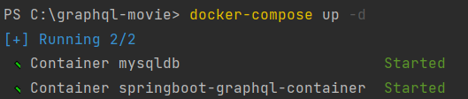
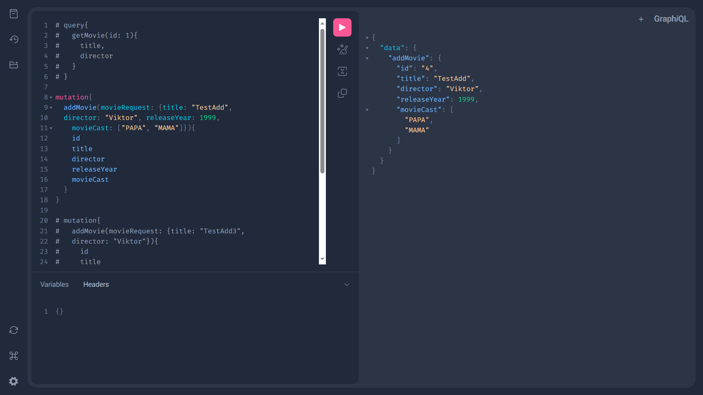

# Spring Boot + GraphQL + PostgreSQL + Redis + Docker Compose + Flyway *Movies API*

---  

This application is designed for viewing, adding, deleting, modifying, and searching movies. It utilizes **GraphQL**, an open-source query language and data manipulation language, to build web-oriented programming interfaces. The project utilizes **Spring for GraphQL**, which is based on **GraphQL Java**. I also implemented caching with the help of **Redis**.

---

## Quick Start
#### Run app with the help of Docker Compose:

    docker-compose up -d

#### Stop application:

    docker stop $(docker ps -a -q)

---

## Writing queries
To write queries, you can utilize a convenient toolkit that I have integrated into this application - **GraphiQL**. **GraphiQL** is an interactive toolkit for working with GraphQL schemas and executing queries against a GraphQL API. It is a web interface typically embedded in a GraphQL server and accessible to developers and testers.
   
    You can get more information about queries using the file resources/graphql/schema.graphqls

